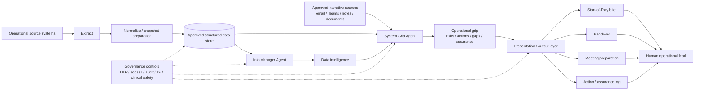

# NHS Operational Intelligence Framework

A reusable, public-safe framework for building operational intelligence agents for NHS System Coordination Centres (SCCs), integrated care systems, urgent and emergency care teams, acute/community providers, operational control centres and similar public-sector environments.

> **Community project / reference framework:** This is an independently developed, reusable reference framework and is not an official NHS England product, national standard or endorsed deployment model. It contains no live NHS data, patient information, local tenant configuration, credentials or production endpoints.

## What this framework contains

The framework separates operational intelligence into two complementary AI layers, supported by a controlled data pipeline and presentation layer:

1. **Info Manager Agent — data intelligence layer**  
   Interprets structured operational snapshots using an explicit data contract, provenance rules, NULL handling, reporting cadence, like-for-like comparisons, seasonality and signal/noise controls.

2. **System Grip Agent — operational grip, assurance and decision-support layer**  
   Combines the authoritative quantitative position with approved narrative evidence to identify risks, actions, owners, deadlines, unresolved issues, discrepancies and "grip gaps".

3. **Presentation/output layer — human-usable operational products**  
   Converts the intelligence into concise outputs such as a Start-of-Play brief, handover, meeting preparation pack, action log or executive brief.

The intended output is not a prettier dashboard. It is concise, traceable operational intelligence that helps a human operational lead understand **what changed, what matters, what is unresolved and what needs to happen next**.

## The five-stage pattern

```text
EXTRACT
Operational readings are retrieved from approved source systems.
    ↓
NORMALISE
A controlled process creates predictable snapshot and summary data products.
    ↓
INTERPRET
The Info Manager Agent identifies movement, context, signal and emerging risk.
    ↓
ASSURE
The System Grip Agent combines quantitative and narrative evidence and identifies gaps.
    ↓
PRESENT
The result is turned into a human-reviewed operational brief, handover or action product.
```

This separation is deliberate. Deterministic data preparation should happen before generative interpretation wherever possible.

## Flagship worked example — Start-of-Play Brief

The framework includes a synthetic HTML example showing how the two intelligence layers can come together in one operational product:

[`examples/start-of-play-brief.html`](examples/start-of-play-brief.html)

The pattern is:

```text
LATEST QUANTITATIVE POSITION
            +
RECENT NARRATIVE EVIDENCE
            ↓
OPERATIONAL INTERPRETATION
            ↓
QUESTIONS TO SECURE
            ↓
PRIORITY ACTIONS
            ↓
GRIP GAPS
            ↓
FIRST-TOUCHPOINT MESSAGE
```

All example organisations, values, actions and sources are fictional.

## Design principles

- **Human-led:** agents support operational judgement; they do not replace accountable decision-makers.
- **Provenance first:** every quantitative claim is traceable to a dated source.
- **Separate fact, narrative, interpretation and absence.**
- **Point-in-time is not trend:** trend language requires multiple comparable observations.
- **No silent interpolation:** missing data remains missing.
- **Raw reading is not necessarily hourly value:** where several readings occur in an interval, apply the documented deterministic selection rule.
- **Time semantics are explicit:** timestamp storage timezone, reporting timezone and daylight-saving behaviour must be documented.
- **No patient-identifiable information in generated operational outputs.**
- **Least privilege:** users and agents should only access sources they are already authorised to use.
- **Local assurance is mandatory:** information governance, clinical safety, security, DLP, records management and operational ownership remain the deploying organisation's responsibility.
- **Configuration, not hard-coding:** use environment variables, connection references and placeholders for deployment-specific values.
- **Open by design, safe by default:** publish reusable logic and documentation, not live operational context.

## Reference architecture



The diagram is a **logical** architecture. The two agents can be implemented independently or orchestrated. Do not assume that one agent should automatically call the other unless the local platform, permissions and assurance model support that design.

## Quick start for another organisation

1. Read [`docs/overview.md`](docs/overview.md).
2. Define local source authority and complete the data dictionary.
3. Review [`docs/data-contract.md`](docs/data-contract.md) and [`docs/timestamp-and-cadence.md`](docs/timestamp-and-cadence.md).
4. Adapt the public-safe SQL patterns in [`sql/`](sql/) to local approved source tables **privately**.
5. Build the snapshot/summary process.
6. Configure the Info Manager Agent from [`agents/info-manager/`](agents/info-manager/).
7. Test against synthetic data before using current operational data.
8. Configure the System Grip Agent from [`agents/system-grip/`](agents/system-grip/).
9. Review [`governance/`](governance/) and complete local assurance.
10. Use [`templates/start-of-play-brief.html`](templates/start-of-play-brief.html) or another approved output pattern.
11. Start read-only and human-reviewed.
12. Only automate distribution/actions after evidence, ownership and controls are mature.

## Repository map

- [`docs/`](docs/) — concepts, data contract, timestamp/cadence, provenance, output design and public-safety review
- [`architecture/`](architecture/) — architecture, trust boundaries and design decisions
- [`agents/`](agents/) — public-safe instruction templates and tests
- [`power-automate/`](power-automate/) — flow specifications and environment-variable patterns
- [`sql/`](sql/) — optional generic SQL examples based on real implementation patterns but stripped of local object names
- [`templates/`](templates/) — morning brief, Start-of-Play, handover, action and grip-gap templates
- [`sample-data/`](sample-data/) — wholly synthetic data for testing
- [`governance/`](governance/) — IG, DPIA, clinical safety, access, model-risk and assurance templates
- [`examples/`](examples/) — synthetic worked outputs
- [`implementation/`](implementation/) — phased deployment plan and go-live checklist
- [`tools/`](tools/) — lightweight public-release safety scanner

## Data implementation notes

The public SQL examples model three useful data products:

- **live/current-day raw readings** with a 24-hour scaffold;
- **previous complete day raw readings**;
- **long-horizon daily summary** based on complete days only.

The raw extracts intentionally preserve multiple readings within an hour. If the analytical use case requires one value per indicator/hour, apply a documented rule such as **latest timestamp wins** in the deterministic transformation layer or explicitly in the agent logic.

A scaffold row containing NULLs only means that no source reading matched that interval. Whether that means **future/not yet reported**, **expected cadence**, or **unexpected data silence** must be established from the reporting clock and indicator dictionary.

## Recommended implementation pattern

1. Define the operational questions and accountable owners.
2. Agree an explicit structured-data contract.
3. Document timestamp storage, reporting timezone and expected cadence.
4. Create controlled raw snapshot products.
5. Create deterministic normalisation/summary products.
6. Build and validate the Info Manager Agent against synthetic and historical test cases.
7. Add approved narrative sources to the System Grip Agent.
8. Configure DLP, authentication, permissions and environment separation.
9. Complete local IG/security/clinical-safety assurance as applicable.
10. Run user acceptance testing with operational leads.
11. Start read-only and human-reviewed.
12. Only automate distribution/actions after evidence, ownership and controls are mature.

See [`implementation/README.md`](implementation/README.md).

## Microsoft implementation

The framework is compatible with Microsoft Copilot Studio, Power Automate, SharePoint, Dataverse, SQL and Microsoft 365 sources. The repository intentionally does not ship a fabricated Power Platform solution export: genuine solution packages contain tenant/environment-specific component metadata and should be built/exported from the deploying organisation's controlled development environment.

Use:
- **Power Platform solutions**
- **environment variables**
- **connection references**
- **separate development/test/production environments**
- **DLP/data policies**
- **authenticated knowledge sources**
- **least-privilege service/user connections**

See [`power-automate/README.md`](power-automate/README.md).

## Safety boundary

This framework is **not**:
- a real-time operational feed unless explicitly engineered and validated as one;
- an autonomous incident commander;
- a clinical decision-support product by default;
- a substitute for source-system validation;
- permission to place identifiable/confidential material into an AI product;
- a national NHS standard.

If local use could influence patient care, clinical decisions or safety-critical operational actions, seek local Clinical Safety Officer advice and assess applicable clinical risk-management requirements before go-live.

## Synthetic data only

Everything under `sample-data/` and `examples/` is fictional. Do not replace it with production exports in a public fork.

## Licence

Apache License 2.0. See [`LICENSE`](LICENSE).

## Official guidance used when designing this framework

- Microsoft Learn — Copilot Studio knowledge sources: https://learn.microsoft.com/en-us/microsoft-copilot-studio/knowledge-copilot-studio
- Microsoft Learn — Copilot Studio security and governance: https://learn.microsoft.com/en-us/microsoft-copilot-studio/security-and-governance
- Microsoft Learn — Power Platform environment variables: https://learn.microsoft.com/en-us/power-apps/maker/data-platform/environmentvariables
- NHS England — Artificial intelligence and information governance: https://transform.england.nhs.uk/information-governance/guidance/artificial-intelligence/
- NHS England — Digital clinical safety assurance: https://www.england.nhs.uk/long-read/digital-clinical-safety-assurance/
- NHS England — DTAC resources: https://transform.england.nhs.uk/key-tools-and-info/digital-technology-assessment-criteria-dtac/
- ICO — AI and data protection: https://ico.org.uk/for-organisations/uk-gdpr-guidance-and-resources/artificial-intelligence/
- GOV.UK — Technology Code of Practice: https://www.gov.uk/guidance/the-technology-code-of-practice
- GOV.UK — AI, open code and vulnerability risk in the public sector: https://www.gov.uk/guidance/ai-open-code-and-vulnerability-risk-in-the-public-sector

## Disclaimer

This repository provides reusable patterns and documentation, not legal, clinical, information-governance or cyber-security approval. Deploying organisations must complete their own assurance and validate current national/local requirements.
