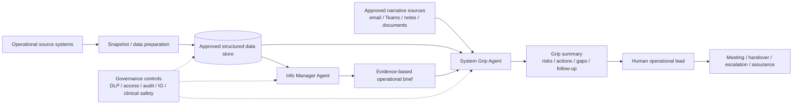

# NHS Operational Intelligence Framework

A reusable, public-safe framework for building operational intelligence agents for NHS System Coordination Centres (SCCs), integrated care systems, urgent and emergency care teams, acute/community providers, operational control centres and similar public-sector environments.

> **Status:** reference framework and implementation accelerator. This repository does **not** contain live NHS data, local tenant configuration, patient information, credentials, production endpoints or a deployable clinical system.

## What this framework contains

The framework separates operational intelligence into two complementary layers:

1. **Info Manager Agent — data intelligence layer**  
   Interprets structured operational snapshots using an explicit data contract, provenance rules, NULL handling, like-for-like comparisons, seasonality and signal/noise controls.

2. **System Grip Agent — operational grip, assurance and decision-support layer**  
   Combines the authoritative quantitative position with narrative evidence from approved collaboration/document sources to identify risks, actions, owners, deadlines, unresolved issues, discrepancies and "grip gaps".

The intended output is not a prettier dashboard. It is concise, traceable operational intelligence that helps a human operational lead understand **what changed, what matters, what is unresolved and what needs to happen next**.

## Design principles

- **Human-led:** agents support operational judgement; they do not replace accountable decision-makers.
- **Provenance first:** every quantitative claim is traceable to a dated source.
- **Separate fact, narrative, interpretation and absence.**
- **Point-in-time is not trend:** trend language requires multiple comparable observations.
- **No silent interpolation:** missing data remains missing.
- **No patient-identifiable information in generated operational outputs.**
- **Least privilege:** users and agents should only access sources they are already authorised to use.
- **Local assurance is mandatory:** information governance, clinical safety, security, DLP, records management and operational ownership remain the deploying organisation's responsibility.
- **Configuration, not hard-coding:** use environment variables, connection references and placeholders for deployment-specific values.
- **Open by design, safe by default:** publish reusable logic and documentation, not live operational context.

## Reference architecture

The diagram is a **logical** architecture. The two agents can be implemented independently or orchestrated. Do not assume that one agent should automatically call the other unless the local platform, permissions and assurance model support that design.

## Repository map

- [`docs/`](docs/) — concepts, data contract, source provenance, privacy review and glossary
- [`architecture/`](architecture/) — architecture, trust boundaries and design decisions
- [`agents/`](agents/) — public-safe instruction templates for both agents
- [`power-automate/`](power-automate/) — flow specifications and environment-variable patterns
- [`sql/`](sql/) — optional generic SQL examples and data-contract helpers
- [`templates/`](templates/) — morning brief, handover, action and grip-gap templates
- [`sample-data/`](sample-data/) — wholly synthetic data for testing
- [`governance/`](governance/) — IG, DPIA, clinical safety, access, model-risk and assurance templates
- [`examples/`](examples/) — synthetic worked outputs
- [`implementation/`](implementation/) — phased deployment plan and go-live checklist
- [`tools/`](tools/) — lightweight public-release safety scanner

## Recommended implementation pattern

1. Define the operational questions and accountable owners.
2. Agree an explicit structured-data contract.
3. Create a controlled snapshot process.
4. Build and validate the Info Manager Agent against synthetic and historical test cases.
5. Add approved narrative sources to the System Grip Agent.
6. Configure DLP, authentication, permissions and environment separation.
7. Complete local IG/security/clinical-safety assurance as applicable.
8. Run user acceptance testing with operational leads.
9. Start read-only and human-reviewed.
10. Only automate distribution/actions after evidence, ownership and controls are mature.

See [`implementation/README.md`](implementation/README.md).

## Microsoft implementation

The framework is compatible with Microsoft Copilot Studio, Power Automate, SharePoint, Dataverse, SQL and Microsoft 365 sources. The repository intentionally does not ship a fabricated Power Platform solution export: genuine solution packages contain tenant/environment-specific component metadata and should be built/exported from the deploying organisation's controlled development environment.

Use:
- **Power Platform solutions**
- **environment variables**
- **connection references**
- **separate development/test/production environments**
- **DLP/data policies**
- **authenticated knowledge sources**
- **least-privilege service/user connections**

See [`power-automate/README.md`](power-automate/README.md).

## Safety boundary

This framework is **not**:
- a real-time operational feed;
- an autonomous incident commander;
- a clinical decision-support product by default;
- a substitute for source-system validation;
- permission to place identifiable/confidential material into an AI product;
- a national NHS standard.

If local use could influence patient care, clinical decisions or safety-critical operational actions, seek local Clinical Safety Officer advice and assess applicable clinical risk-management requirements before go-live.

## Synthetic data only

Everything under `sample-data/` and `examples/` is fictional. Do not replace it with production exports in a public fork.

## Licence

Apache License 2.0. See [`LICENSE`](LICENSE).

## Official guidance used when designing this framework

- Microsoft Learn — Copilot Studio knowledge sources: https://learn.microsoft.com/en-us/microsoft-copilot-studio/knowledge-copilot-studio
- Microsoft Learn — Copilot Studio security and governance: https://learn.microsoft.com/en-us/microsoft-copilot-studio/security-and-governance
- Microsoft Learn — Power Platform environment variables: https://learn.microsoft.com/en-us/power-apps/maker/data-platform/environmentvariables
- NHS England — Artificial intelligence and information governance: https://transform.england.nhs.uk/information-governance/guidance/artificial-intelligence/
- NHS England — Digital clinical safety assurance: https://www.england.nhs.uk/long-read/digital-clinical-safety-assurance/
- NHS England — DTAC resources: https://transform.england.nhs.uk/key-tools-and-info/digital-technology-assessment-criteria-dtac/
- ICO — AI and data protection: https://ico.org.uk/for-organisations/uk-gdpr-guidance-and-resources/artificial-intelligence/
- GOV.UK — Technology Code of Practice: https://www.gov.uk/guidance/the-technology-code-of-practice
- GOV.UK — AI, open code and vulnerability risk in the public sector: https://www.gov.uk/guidance/ai-open-code-and-vulnerability-risk-in-the-public-sector

## Disclaimer

This repository provides reusable patterns and documentation, not legal, clinical, information-governance or cyber-security approval. Deploying organisations must complete their own assurance and validate current national/local requirements.
